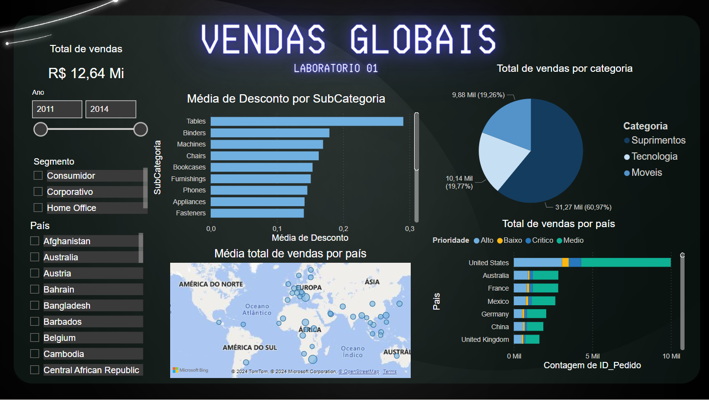

# Dashboards

Microsoft Power BI Para Business Intelligence e Data Science da Data Science Academy

Laboratorio 1 - Descrição do Projeto

Este projeto consiste na criação de um dashboard analítico de vendas globais utilizando o Microsoft Power BI. O objetivo é fornecer uma ferramenta visual e interativa para análise dos dados de vendas de uma empresa fictícia que opera globalmente. O dashboard responde a perguntas importantes sobre as vendas, como o valor total vendido, vendas por categoria de produto e país, média de desconto por subcategoria e países com maior média de valor de venda. Os usuários podem filtrar os dados por ano, segmento e país para uma análise mais específica. O projeto utiliza o Power BI para visualização e análise de dados.

Para interagir com o  dashboard, [clique aqui](https://app.powerbi.com/view?r=eyJrIjoiYTE3NjMyMDEtNGZjNi00OWNhLWJjNmItN2ZhNDYwMjc0YmVjIiwidCI6IjE5ZDk1YzVmLTkwOGMtNDdkYS05NTllLTdhMTk3ZjUyOGZmOSJ9).

---

